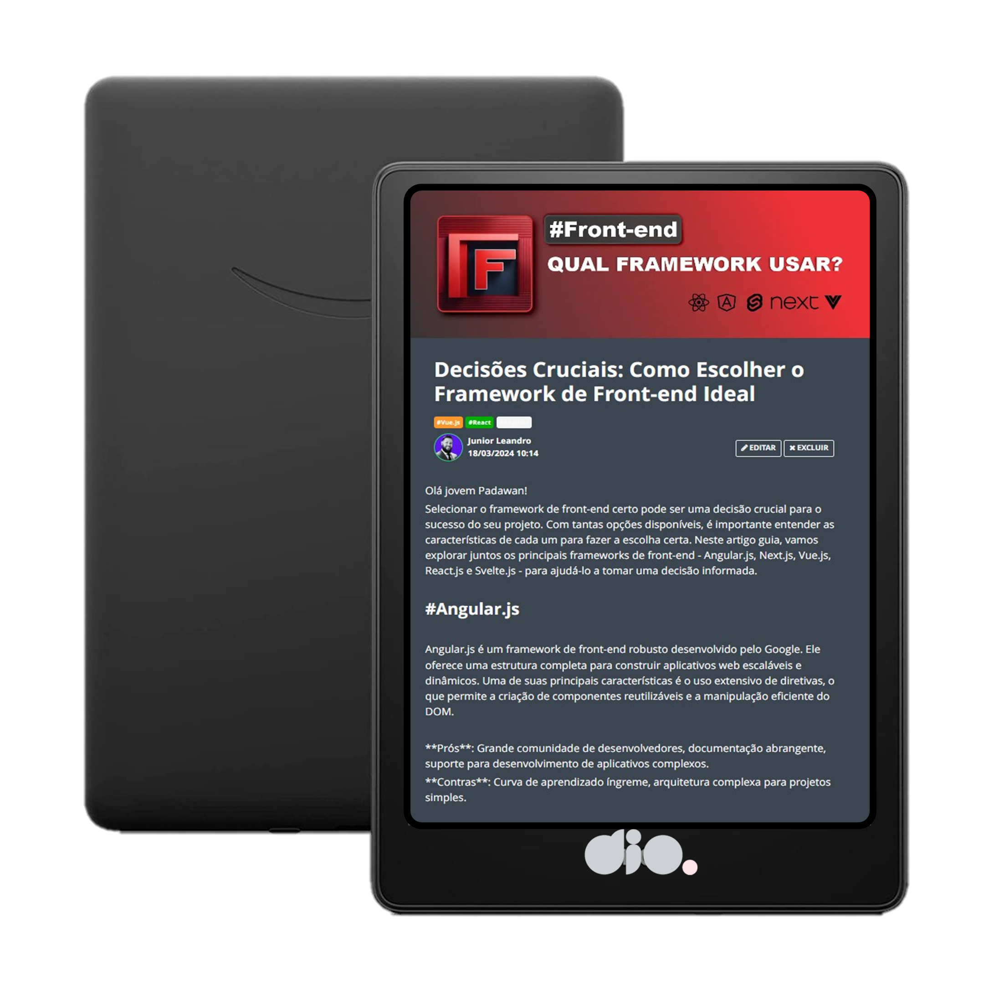

  

# Projeto artigo técnico gerado por I.A.s

Projeto com o objetivo de gerar um artigo técnico com um layout rico, leitura agradável e com foco em promover autoridade técnica.

<a href="https://web.dio.me/articles/decisoes-cruciais-como-escolher-o-framework-de-front-end-ideal?back=/home" title="View PDF now">Clique aqui para ler o artigo ✅</a>

## 💻 Tecnologias utilizadas no projeto

- [ChatGPT](https://chat.openai.com/) - Para título e conteúdo
- [Lexica.art](https://lexica.art/) - Para gerar imagens
- [CorelDraw](https://www.coreldraw.com/) - Para formatação de banners e Layouts

## 📄 Prompts e ferramentas

### ChatGPT：

- No chatGPT foram utilizadas varias regras que podem sem encontrardas no arquivo 
[prompt.md](./assets/prompt.md) 

### Lexica.art：

- No léxica utilizei o acervo público de imagens geradas por outras pessoas, os termos de pesquisa que utilizei durante as buscas foram:

• Framework
• Framework JavaScript

## ✨ Features

- Conteúdo gerado via ChatGPT
- Imagens do acervo público geradas via Lexica.art

## 👨‍💻 Expert

    
    
&nbsp&nbsp&nbsp&nbspJunior Oiveira Leandro 
    &nbsp&nbsp&nbsp
    <a href="https://github.com/junior-leandro">
    GitHub</a>&nbsp&nbsp;|&nbsp;
    <a href="www.linkedin.com/in/junior-leandro">LinkedIn</a>
&nbsp;|&nbsp;
    <a href="https://www.instagram.com/jr_uba">
    Instagram</a>
&nbsp;&nbsp;

  

---

Code with 💜 by [Junior Leandro](https://github.com/junior-leandro)